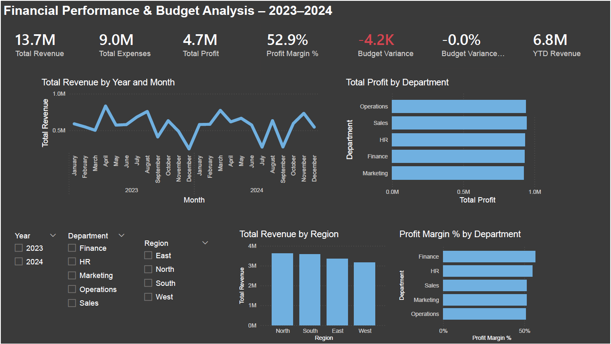

# 📊 Financial Performance Dashboard – Power BI

## 📌 Project Overview
This project analyzes company revenue, expenses, profitability, and budget performance using Power BI.

## 🎯 Business Problem
Management required a centralized financial reporting tool to monitor performance across departments and regions.

## 🧹 Data Preparation
- Cleaned transaction data using Power Query
- Verified data types
- Created calculated Profit column
- Implemented star schema model

## 📐 Data Modeling
- Fact table: Fact_Transactions
- Dimension tables: Dim_Department, Dim_Region
- Built star schema relationships

## 📊 KPIs Built
- Total Revenue
- Total Expenses
- Total Profit
- Profit Margin %
- Budget Variance
- YTD Revenue

## 🔍 Key Insights
- Sales department generated highest profit
- Profit margin exceeded 50%
- Minor negative budget variance observed
- Revenue trends show stable growth pattern

## 🛠 Tools Used
- Power BI Desktop
- DAX
- Power Query
- Data Modeling
