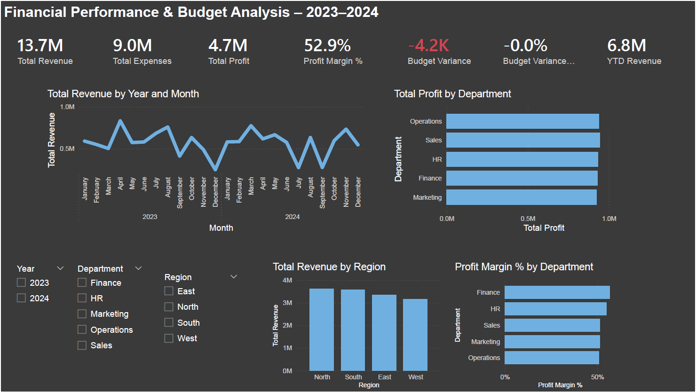

# 📊 Financial Performance Dashboard – Power BI

## 📌 Project Overview
This Power BI project provides management with a centralized view of revenue, expenses, profit, profit margin, budget variance, and year-to-date performance across departments and regions.

## 🎯 Business Problem
Fragmented financial reports make it difficult for management to identify performance drivers, compare departments, and detect budget pressure early. A consolidated reporting tool was needed to answer:

- Are revenue and profit tracking to expectations?
- Which departments and regions drive performance?
- Where are actual results diverging from budget?
- Is profitability improving over time?

## 🧹 Data Preparation
- Cleaned and validated transaction data in Power Query.
- Standardized data types and created the required profit fields.
- Built a star-schema model using a transaction fact table and department and region dimensions.
- Developed DAX measures for revenue, expenses, profit, margin, budget variance, and YTD revenue.
-  Designed an executive dashboard with KPI cards, trend analysis, and dimensional comparisons.

## 📐 Data Modeling
- Fact table: Fact_Transactions
- Dimension tables: Dim_Department, Dim_Region
- Built star schema relationships

## 🛠 Tools Used
- Power BI Desktop
- DAX
- Power Query
- Data Modeling

## 📊 KPIs Built
- Total Revenue
- Total Expenses
- Total Profit
- Profit Margin %
- Budget Variance
- YTD Revenue

## 🔍 Key Insights

- The Sales department generated the highest profit in the project dataset.
- Overall profit margin exceeded 50%.
- A small negative budget variance indicates that actual performance was slightly below the relevant budget benchmark.
- Revenue trends show a generally stable growth pattern.
- These findings relate to the demonstration dataset and should not be generalized to a real organization.

## Recommendations

- Investigate the activities driving Sales department profitability and assess whether they can be replicated.
- Break budget variance into price, volume, cost, department, and regional drivers.
- Establish exception thresholds for unfavorable variances.
- Add monthly rolling forecasts so management can act before year-end.
- Separate recurring and non-recurring income and costs for a clearer operational view.

## Business Value

- Gives management one view of actual financial performance.
- Links executive KPIs to department and regional detail.
- Makes budget deviations visible earlier.
- Demonstrates financial modeling, DAX, Power Query, and management reporting skills.

## Data Model

- Fact table: Fact_Transactions
- Dimension tables: Dim_Department, Dim_Region

## Limitations

- The current README documents a demonstration dataset and does not include a live accounting-system integration.
- Forecast, scenario, cash-flow, and balance-sheet analysis are outside the present scope.
- The causes of variance require deeper transactional investigation.

## Future Improvements

- Add a date dimension and full monthly/YTD/YoY time intelligence.
- Add forecast, prior-year, and scenario comparisons.
- Introduce drill-through to transaction detail.
- Add cash-flow and working-capital pages.
- Automate refresh and financial data-quality checks.

Author

Jack Kisutsa
Business Analyst | Business Intelligence Analyst | Financial & Performance Analyst
